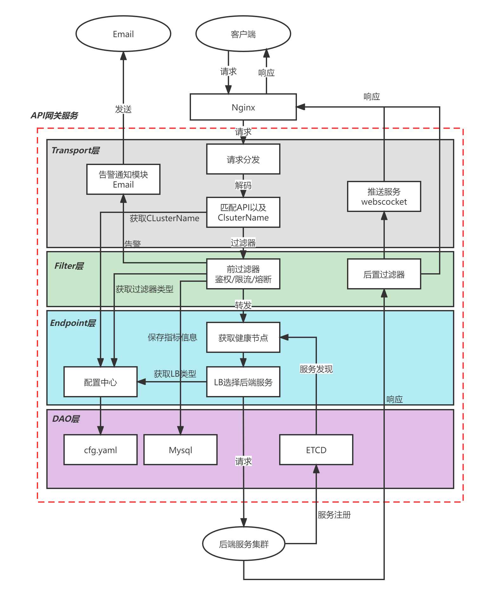

# api-gateway
### 网关架构视图

API网关主要有以下功能模块：
+ transport层：数据解码，匹配对应ClusterName以及API
+ filter层：前置和后置过滤器
+ endpoint层：和后端建立链接，转发业务请求
+ dao层：持久化中间结果，以及配置信息
### API网关功能
+ 负载均衡
+ 服务注册与发现
+ 流控
+ 熔断
+ 服务降级
+ API聚合
+ 鉴权
+ 超时控制
+ 租期控制
+ 并发控制
